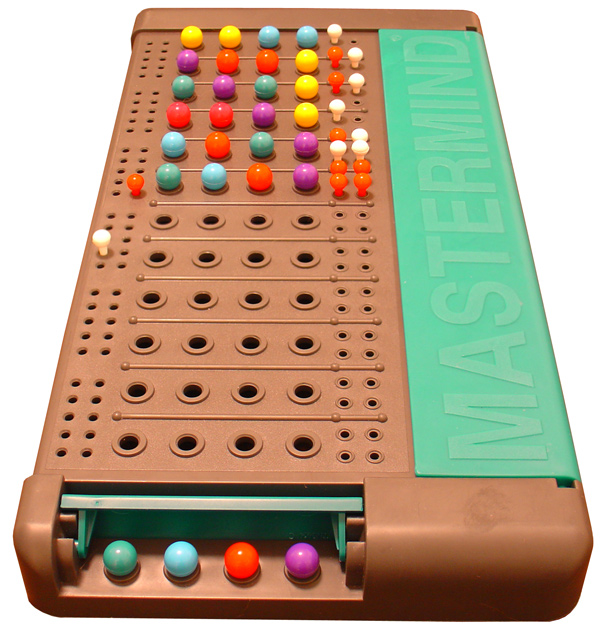

#Mastermind

## Enoncé

Le maître du jeu choisit 4 couleurs ($masterColors).
Le joueur choisit 4 couleurs ($playerColors).
Le but est de comparer les couleurs du maître du jeu avec celles du joueur.
Le maître du jeu place autant de pions blanc que de couleurs mal placées et autant de pions rouges que de couleurs bien placées.  
Le joueur gagne s'il a trouvé toutes les couleurs bien positionnées.  
La méthode `getScore()` devra retourner un tableau contenant deux valeurs `[a, b]` :
- `a` le nombre de couleurs mal placées
- `b` le nombre de couleurs bien placées  
Elle devra retourner `win` en cas de victoire.
    
## Étape 1
Installer PHPUnit

## Étape 2  
Écrire les tests de la classe `MasterMind` pour les séquences suivantes :
1. séquence 1
-  maître : `'blue', 'green', 'white', 'black'`
- joueur : `'purple', 'orange', 'pink', 'yellow'`
2. séquence 2
- maître : `'blue', 'green', 'white', 'black'`
- joueur : `'red', 'blue', 'green', 'pink'`
3. séquence 3
- maître : `'blue', 'green', 'white', 'black'`
- joueur : `'blue', 'orange', 'pink', 'yellow'`
4. séquence 4
- maître : `'blue', 'green', 'white', 'black'`
- joueur : `'red', 'blue', 'green', 'black'`
5. séquence 5
- maître : `'blue', 'green', 'white', 'black'`
- joueur : `blue', 'green', 'white', 'black'`

## Étape 3
Écrire la logique de la méthode `getScore()`

